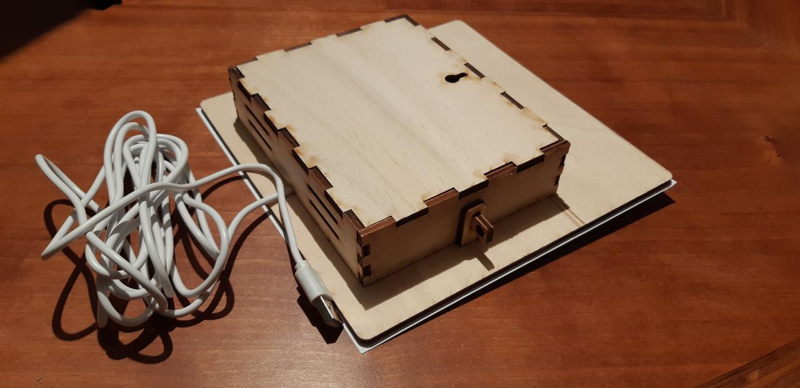
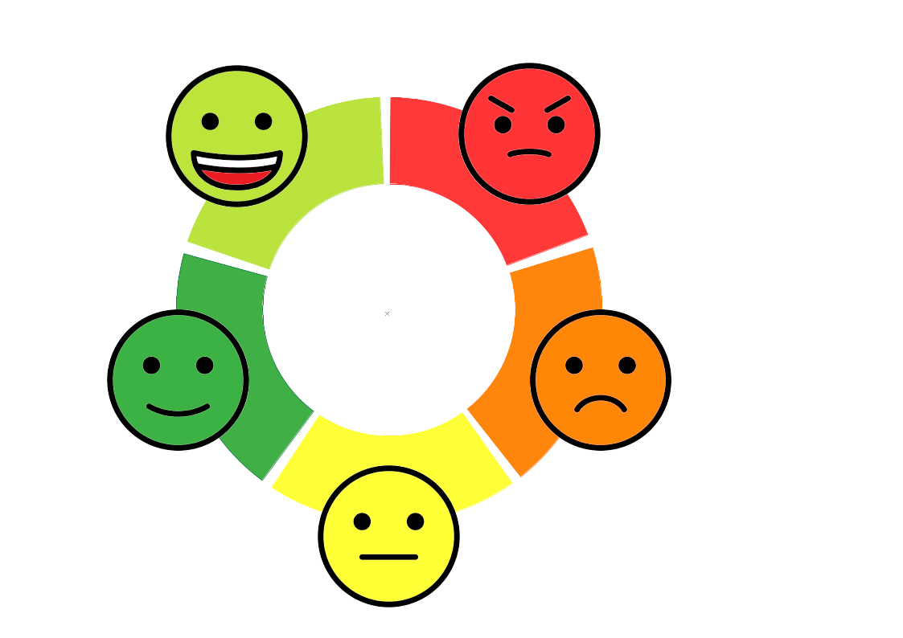

# Arduino mood barometer with ESP32

This project implements an analog display that gets its data from an [MQTT broker](http://mqtt.org/). 

Download link for construction of the housing in Fusion 360

http://a360.co/2nmHa7m

The ESP32 development board I used features a built-in hall effect sensor, it detects changes in the magnetic field in its surroundings, i.e. the magnet mounted on the clock-arm. 

The idea and housing came from a [blog post](https://www.bastelgarage.ch/index.php?route=extension/d_blog_module/post&post_id=10) on a Swiss onlineshop for DIY electronics [www.bastelgarage.ch](www.bastelgarage.ch). 

## Components

* NodeMCU-32S ESP32 WiFi Bluetooth development board
* Stepper motor 28BYJ-28 with a ULN2003 driver board
* 6x10mm neodymium bar magnet

## Clock Face

The smileys I got from https://openmoji.org/

I created it using the [GIMP](https://www.gimp.org/), the XCF file is included in the repository.

## MQTT

The MQTT broker is configured to require client authentication using a valid username and password before a connection is permitted.

Run each command in a different terminal to monitor topics:
> mosquitto_sub -h localhost -t team1/moodometer -u "sammy" -P "1234"  
> mosquitto_sub -h localhost -t team1/mood -u "sammy" -P "1234" 

Send command to barometer to change mood (-m is message we are sending an int between 1 and 5):
> mosquitto_pub -h localhost -t team1/mood -m "1" -u "sammy" -P "1234" 

