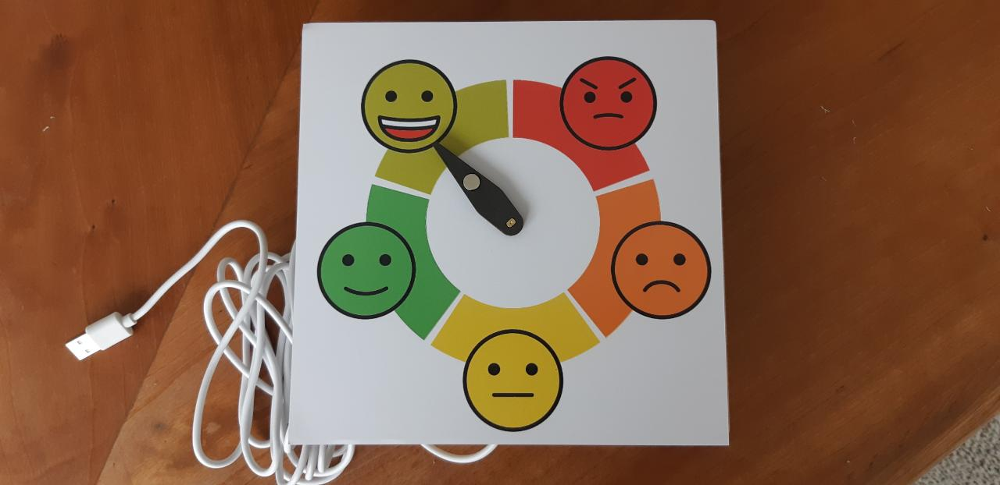
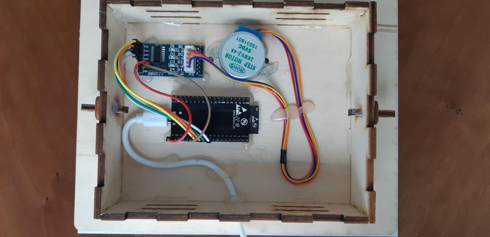

# Arduino mood barometer with ESP32

This project implements an analog display that gets its data from an [MQTT broker](http://mqtt.org/). 

Download link for construction of the housing in Fusion 360

http://a360.co/2nmHa7m

## Components

* NodeMCU-32S ESP32 WiFi Bluetooth development board
* Stepper motor 28BYJ-28 with a ULN2003 driver board
* 6x10mm neodymium bar magnet
